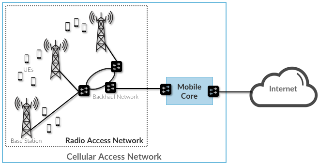
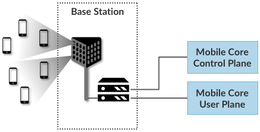
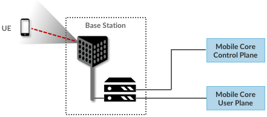
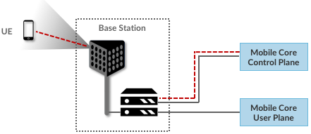
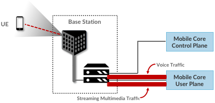
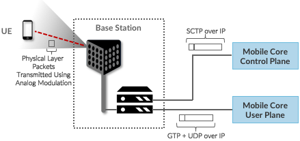
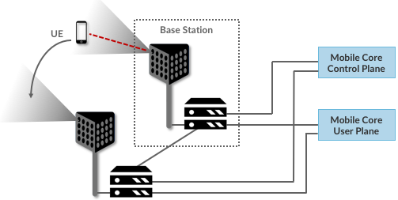
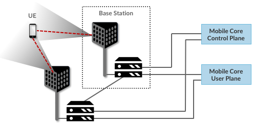
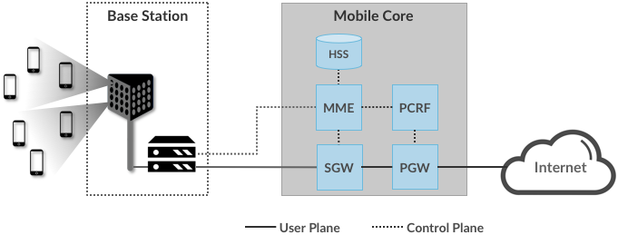

# Chapter 3: Architecture

<figure>
	
	
	<figcaption>Cellular networks consists of a Radio Access Network
	(RAN) and a Mobile Core.</figcaption>
</figure>

<figure>
	
	
	<figcaption>Mobile Core divided into a Control Plan and a User
	Plane, an architectural feature known as CUPS: Control and User
	Plane Separation</figcaption>
</figure>

<figure>
	
	
	<figcaption>Base Station detects (and connects to) active UEs.</figcaption>
</figure>

<figure>
	
	
	<figcaption>Base Station establishes control plane connectivity
	between each UE and the Mobile Core.</figcaption>
</figure>

<figure>
	
	
	<figcaption>Base station establishes one or more tunnels between
	each UE and the Mobile Core's User Plane.</figcaption>
</figure>

<figure>
	
	
	<figcaption>Base Station to Mobile Core (and Base Station to Base
	Station) control plane tunneled over SCTP/IP and user plane
	tunneled over GTP/UDP/IP.</figcaption>
</figure>

<figure>
	
	
	<figcaption>Base Stations cooperate to implement UE hand over.</figcaption>
</figure>

<figure>
	
	
	<figcaption>Base Stations cooperate to implement multipath
	transmission (link aggregation) to UEs.</figcaption>
</figure>

<figure>
	
	
	<figcaption>Mobile Core disaggregated into a Service Mesh.</figcaption>
</figure>
