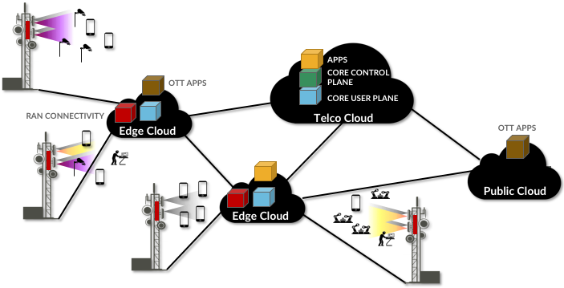

Chapter 7:  Cloudification of Access
====================================

The previous chapters went step-by-step, first breaking 5G down into its
elemental components and then showing how those components could be put
back together using best practices in cloud design to build a fully
functional, 3GPP-compliant 5G cellular network. In doing so, it is easy
to lose sight of the big picture, which is that the cellular network is
undergoing a dramatic transformation. That’s the whole point of 5G. We
conclude by making some observations about this big picture.

To understand the impact, it is helpful to first understand what’s
important about the cloud. The cloud has fundamentally changed the way
we compute, and more importantly, the pace of innovation. It has done
this through a combination of:

-  **Disaggregation:** Breaking vertically integrated systems into
   independent components with open interfaces.

-  **Virtualization:** Being able to run multiple independent copies of
   those components on a common hardware platform.

-  **Commoditization:** Being able to elastically scale those virtual
   components across commodity hardware bricks as workload dictates.

There is an opportunity for the same to happen with the access network,
or from another perspective, for the cloud to essentially expand so far
as to subsume the access network.

.. _fig-cloud:

    Figure 7.1: A multi-tenant / multi-cloud—including virtualized RAN
    resources alongside conventional compute, storage, and network
    resources—hosting both Telco and Over-the-Top (OTT) services and
    applications.

:ref:`Figure 7.1 <fig-cloud>` gives a high-level overview of how the
transformation might play out, with the global cloud spanning edge
clouds, private Telco clouds, and the familiar public clouds. Each
individual cloud site is potentially owned by a different organization
(this includes the cell towers, as well), and as a consequence, each
site will likely be multi-tenant in that it is able to host (and
isolate) applications on behalf of many other people and organizations.
Those applications, in turn, will include a combination of the RAN and
Core services (as described throughout this book), Over-the-Top (OTT)
applications commonly found today in public clouds (but now also
distributed across edge clouds), and new Telco-managed applications
(also distributed across centralized and edge locations).

Eventually, we can expect common APIs to emerge, lowering the barrier
for anyone (not just today’s network operators or cloud providers) to
deploy applications across multiple sites by acquiring the storage,
compute, networking, and connectivity resources they need.
