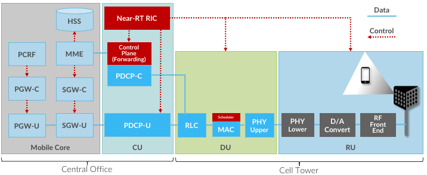
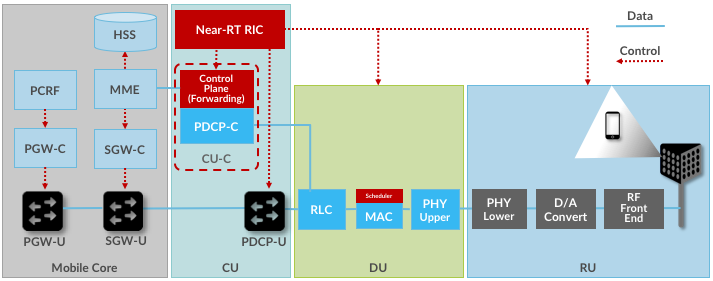
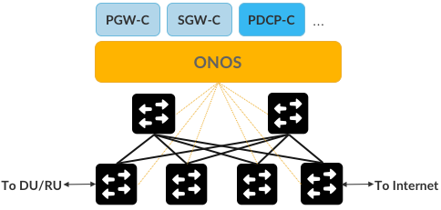
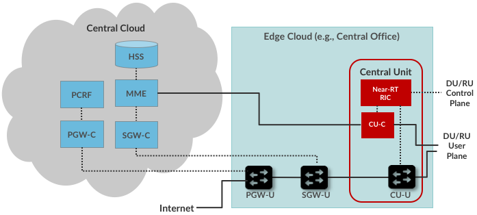
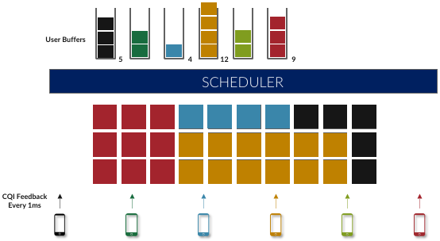
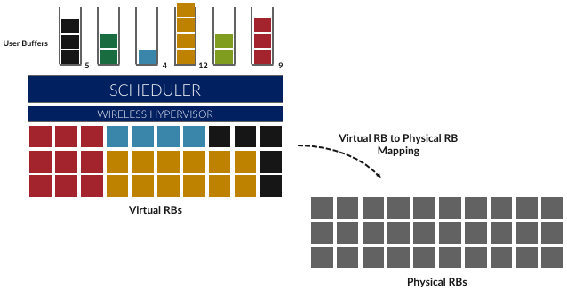
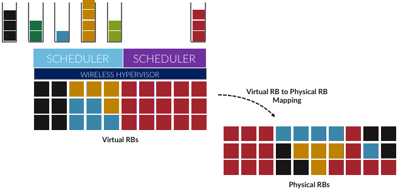
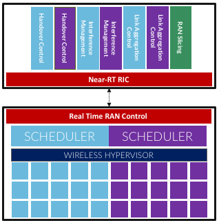
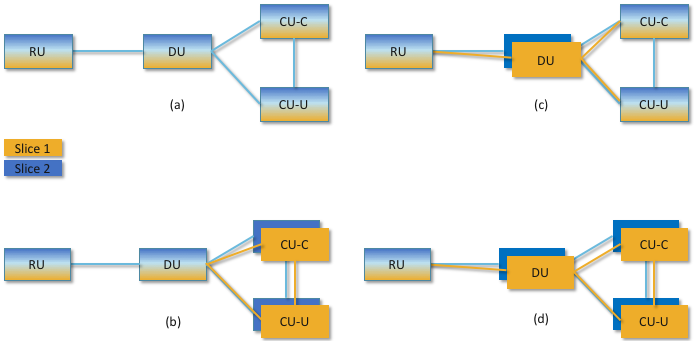

Chapter 5:  Advanced Capabilities
=================================

Disaggregating the cellular network pays dividends. This chapter
explores three examples. Stepping back to look at the big picture,
Chapter 3 (Architecture) described “what is” (the basics of 3GPP) and
Chapter 4 (RAN Internals) described “what will be” (where the industry
is clearly headed), whereas this chapter describes “what might be”
(our best judgement on cutting-edge capabilities that will eventually
be realized).

5.1 Optimized Data Plane
------------------------

There are many reasons to disaggregate functionality, but one of the
most compelling is that decoupling control and data code paths allows
them to be optimized independently. The data path, for example, can be
optimized by
programming it into specialized hardware. Modern white-box switches with
programmable packet forwarding pipelines are a perfect example of
specialized hardware we can exploit in the cellular network.
:numref:`Figure %s <fig-e2e>` shows the first step in the process
of doing this. The figure also pulls together all the elements we've
been describing up to this point. 

.. _fig-e2e:

    End-to-end disaggregated system, including Mobile Core
    and Split-RAN.

There are several things to note
about this diagram. First, the figure combines both the Mobile Core and RAN elements,
organized according to the major subsystems: Mobile Core, Central Unit
(CU), Distributed Unit (DU), and Radio Unit (RU). The figure also shows
one possible mapping of these subsystems onto physical locations, with
the first two co-located in a Central Office and the latter two
co-located in a cell tower. As discussed earlier, other configurations
are also possible.

Second, the figure shows the Mobile Core’s two user plane elements
(PGW, SGW) and the Central Unit’s single user plane element (PDCP)
further disaggregated into control/user plane pairs, denoted PGW-C /
PGW-U, SGW-C / SGW-U, and PDCP-C / PDCP-U, respectively. Exactly how
this decoupling is realized is an implementation choice (i.e., not
specified by 3GPP), but the idea is to reduce the User Plane component
to the minimal Receive-Packet / Process-Packet / Send-Packet
processing core, and elevate all control-related aspects into the
Control Plane component.

Third, the PHY (Physical) element of the RAN pipeline is split between
the DU and RU partition. Although beyond the scope of this book, the
3GPP spec specifies the PHY element as a collection of functional
blocks, some of which can be effectively implemented by software running
on a general-purpose processor and some of which are best implemented in
specialized hardware (e.g., a Digital Signal Processor). These two
subsets of functional blocks map to the PHY Upper (part of the DU) and
the PHY Lower (part of the RU), respectively.

Fourth, and somewhat confusingly, :numref:`Figure %s <fig-e2e>`
shows the PDCP-C
element and the Control Plane (Forwarding) element combined into a
single functional block, with a data path (blue line) connecting that
block to both the RLC and the MME. Exactly how this pair is realized is
an implementation choice (e.g., they could map onto two or more
microservices), but the end result is that they are part of an
end-to-end path over which the MME can send control packets to the UE.
Note that this means responsibility for demultiplexing incoming packets
between the control plane and user plane falls to the RLC.

.. _fig-e2e-p4:

    Implementing data plane elements of the User Plane in
    programmable switches.

:numref:`Figure %s <fig-e2e-p4>` shows why we disaggregated these
components: it allows us to realize the three user plane elements
(PGW-U, SGW-U, PDCP-U) in switching hardware. This can be done using a
combination of a language that is tailored for programming forwarding
pipelines (e.g., P4), and a protocol-independent switching
architecture (e.g., Intel's Tofino). For now, the important takeaway is that
the RAN and Mobile Core user plane can be mapped directly onto an
SDN-enabled data plane.

.. _reading_p4:
.. admonition:: Further Reading

   For more information about P4 and programmable switching chips, we
   recommend `White-Box Switches
   <https://sdn.systemsapproach.org/switch.html>`__, a chapter in
   *Software-Defined Networking: A Systems Approach*, March 2020.

Pushing RAN and Mobile Core forwarding functionality into the switching
hardware results in overlapping terminology that can be confusing.
5G separates the functional blocks into control and user planes,
while SDN disaggregates a given functional block into control and data
plane halves. The overlap comes from our choosing to implement
the 5G user plane by splitting it into its SDN-based control and data
plane parts. As one simplification, we refer to the Control Plane
(Forwarding) and PDCP-C combination as the CU-C (Central Unit - Control)
going forward.

Finally, the SDN-prescribed control/data plane disaggregation comes with
an implied implementation strategy, namely, the use of a scalable and
highly available *Network Operating System (NOS)*. Like a traditional
OS, a NOS sits between application programs (control apps) and the
underlying hardware devices (whitebox switches), providing higher levels
abstractions (e.g., network graph) to those applications, while hiding
the low-level details of the underlying hardware. To make the discussion
more concrete, we use ONOS (Open Network Operating System) as an example
NOS, where PGW-C, SGW-C, and PDCP-C are all realized as control
applications running on top of ONOS.

.. _fig-onos:

    Control Plane elements of the User Plane implemented
    as Control Applications running on an SDN Controller (e.g., ONOS).

:numref:`Figure %s <fig-onos>` shows one possible configuration in
which the underlying switches are interconnected to form a leaf-spine
fabric. Keep in mind that the linear sequence of switches implied by
:numref:`Figure %s <fig-e2e-p4>` is logical, but that in no way
restricts the actual hardware to the same topology. The reason we use
a leaf-spine topology is related to our ultimate goal of building an
edge cloud, and leaf-spine is the prototypical structure for such
cloud-based clusters.  This means the three control applications must
work in concert to implement an end-to-end path through the fabric,
which in practice happens with the aid of other, fabric-aware, control
applications (as implied by the “…” in the Figure). We describe the
complete picture in more detail in the next chapter, but for now, the
big takeaway is that the control plane components of the 5G overlay
can be realized as control applications for an SDN-based underlay.

5.2 Multi-Cloud
---------------

Another consequence of disaggregating functionality is that once
decoupled, different functions can be placed in different physical
locations. We have already seen this when we split the RAN, placing some
functions (e.g., the PDCP and RRC) in the Central Unit and others (e.g.,
RLC and MAC) in Distributed Units. This allows for simpler (less
expensive) hardware in remote locations, where there are often space,
power, and cooling constraints.

This process can be repeated by distributing the more centralized
elements across multiple clouds, including large datacenters that
already benefit from elasticity and economies of
scale. :numref:`Figure %s <fig-multicloud>` shows the resulting
multi-cloud realization of the Mobile Core. We leave the user plane at
the edge of the network (e.g., in the Central Office) and move control
plane to a centralized cloud. It could even be a public cloud like
Google or Amazon. This includes not only the MME, PCRF, and HSS, but
also the PGW-C and SGW-C we decoupled in the previous section. (Note
that :numref:`Figure %s <fig-multicloud>` renames the PDCP-U from
earlier diagrams as the CU-U; either label is valid.)

.. _fig-multicloud:

    Multi-Cloud implementation, with MME, HSS, PCRF and
    Control Plane elements of the PGW and SGW running in a centralized
    cloud.

What is the value in doing this? Just like the DU and RU, the Edge Cloud
likely has limited resources. If we want room to run new edge services
there, it helps to move any components that need not be local to a
larger facility with more abundant resources. Centralization also
facilitates collecting and analyzing data across multiple edge
locations, which is harder to do if that information is distributed over
multiple sites. (Analytics performed on this data also benefits from
having abundant compute resources available.)

Another reason worth calling out is that it lowers the barrier for
anyone (not just the companies that own and operate the RAN
infrastructure) to offer mobile services to customers. These entities
are called *MVNOs (Mobile Virtual Network Operators)* and one clean
way to engineer an MVNO is to run your own Mobile Core in a cloud of
your choosing.

But the biggest motivation for the configuration shown in
:numref:`Figure %s <fig-multicloud>` is that keeping the user plane
elements of the mobile core at the edge makes it possible to "break
out" local traffic without having to traverse a "hairpin" route that
goes through a central site. This has the potential to dramatically
reduce latency for any edge-hosted services. We return to this topic
in Chapter 7.

5.3 Network Slicing
-------------------

One of the most compelling value propositions of 5G is the ability to
differentiate the level of service offered to different applications
and customers. Differentiation, of course, is key to being able to
charge some customers more than others, but the monetization case
is only part of the story. It is also necessary to support
applications with widely varying requirements. For example, streaming video requires high bandwidth
but can tolerate larger latencies, while IoT has
minimal bandwidth needs but sometimes requires extremely low and predictable
latencies, and entails connecting a *massively scalable* number of
devices. 

The mechanism that supports this sort of differentiation is called
network slicing, and it fundamentally comes down to scheduling, both in
the RAN (deciding which segments to transmit) and in the Mobile Core
(scaling microservice instances and placing those instances on the
available servers). The following introduces the basic idea, starting
with the RAN.

But before getting into the details, we note that a network slice is a
realization of the QoS Class Identifier (QCI) discussed earlier. 3GPP
specifies a standard set of network slices, called *Standardized Slice
Type (SST)* values. For example, SST 1 corresponds to mobile broadband,
SST 2 corresponds to Ultra-Reliable Low Latency Communications, SST 3
corresponds to Massive IoT, and so on. It is also possible to extend
this standard set with additional slice behaviors, as well as define
multiple slices for each SST (e.g., to further differentiate subscribers
based on priority).

Of course, defining a desired set of slices and implementing a slicing
mechanism are two entirely different things. The following sketches
how slices can be implemented.

RAN Slicing
~~~~~~~~~~~

We start by reviewing the basic scheduling challenge previewed in
Chapter 2. As depicted in :numref:`Figure %s <fig-slice-sched>`,
the radio spectrum can be conceptualized as a 2-D grid of
*Resource Blocks (RB)*, where the scheduler’s job is to decide how to fill the
grid with the available segments from each user’s transmission queue
based on CQI feedback from the UEs. To restate, the power of OFDMA is
the flexibility it provides in how this mapping is performed.

.. _fig-slice-sched:

    Scheduler allocating resource blocks to UEs.

While in principle one could define an uber scheduler that takes dozens
of different factors into account, the key to network slicing is to add
a layer of indirection. As shown in :numref:`Figure %s <fig-hypervisor>`,
the idea is to perform a second mapping of Virtual RBs to
Physical RBs. This sort of virtualization is common in resource
allocators throughout computing systems because we want to separate how
many resources are allocated to each user from the decision as to which
physical resources are actually assigned. This virtual-to-physical
mapping is performed by a layer typically known as a *Hypervisor*, and
the important thing to keep in mind is that it is totally agnostic about
which user’s segment is affected by each translation.

.. _fig-hypervisor:

    Wireless Hypervisor mapping virtual resource blocks to
    physical resource blocks.

Having decoupled the Virtual RBs from Physical RBs, it is now possible
to define multiple Virtual RB sets (of varying sizes), each with its own
scheduler. :numref:`Figure %s <fig-multi-sched>` gives an example with two
equal-sized RB sets, where the important consequence is that having made
the macro-decision that the Physical RBs are divided into two equal
partitions, the scheduler associated with each partition is free to
allocate Virtual RBs completely independent from each other. For
example, one scheduler might be designed to deal with high-bandwidth
video traffic and another scheduler might be optimized for low-latency
IoT traffic. Alternatively, a certain fraction of the available capacity
could be reserved for premium customers or other high-priority traffic
(e.g., public safety), with the rest shared among everyone else.

.. _fig-multi-sched:

    Multiple schedulers running on top of wireless
    hypervisor.

Going one level deeper in the implementation details, the real-time
scheduler running in each DU receives high-level directives from the
near-real-time scheduler running in the CU, and as depicted in
:numref:`Figure %s <fig-slicing-control>`, the DUs follow these
directives in making their scheduling decisions *on a
per-slice basis*. A single RAN Slicing control application is responsible for the
macro-scheduling decision by allocating resources among a set of
slices. Understanding this implementation detail is important because
all of these control decisions are implemented by software modules,
and hence, easily changed or customized. They are not “locked” into
the underlying system, as they have historically been in 4G’s eNodeBs.

.. _fig-slicing-control:

    Centralized near-real-time control applications
    cooperating with distributed real-time RAN schedulers.

In summary, the goal of RAN slicing is to programmatically create
virtual RAN nodes (base stations) that operate on the same hardware
and share the spectrum resources according to a given policy for
different applications, services, users, and so on. Tying RAN slicing
back to RAN disaggregation, one can imagine several possible
configurations, depending on the desired level of isolation between
the slices. :numref:`Figure %s <fig-ran-slicing>` shows four examples,
all of which assume slices share the antennas and RF components, which
is effectively the RU: (a) RAN slices share RU, DU, CU-U and CU-C; (b)
RAN slices share RU and DU, but have their own CU-U and CU-C; (c) RAN
slices share RU, CU-U and CU-C, but have their own DU; and (d) RAN
slices share RU, but have their own DU, CU-U and CU-C.

.. _fig-ran-slicing:

    Four possible configurations of a disaggregated RAN in support of
    RAN slicing.

Core Slicing
~~~~~~~~~~~~

In addition to slicing the RAN, we also need to slice the Mobile Core.
In many ways, this is a well-understood problem, involving QoS
mechanisms in the network switches (i.e., making sure packets flow
through the switching fabric according to the bandwidth allocated to
each slice) and the cluster processors (i.e., making sure the containers
that implement each microservice are allocated sufficient CPU cores to
sustain the packet forwarding rate of the corresponding slice).

But packet scheduling and CPU scheduling are low-level mechanisms. What
makes slicing work is to also virtualize and replicate the entire
service graph that implements the Mobile Core. If you think of a slice as
a system abstraction, then that abstraction needs to keep track of the
set of interconnected microservices that implement each slice,
and then instruct the underlying packet schedulers to allocate
sufficient network bandwidth to the slice’s flows and the underlying CPU
schedulers to allocate sufficient compute cycles to the slice’s
containers.

For example, if there are two network slices (analogous to the two RAN
schedulers shown in :numref:`Figures %s <fig-multi-sched>` and
:numref:`%s <fig-slicing-control>`), then there would also need
to be two Mobile Core service graphs: One set of AMF, SMF, UPF,…
microservices running on behalf of the first slice and a second set of
AMF, SMF, UPF,… microservices running on behalf of the second
slice. These two graphs would scale independently (i.e., include a
different number of container instances), depending on their
respective workloads and QoS guarantees.  The two slices would also be
free to make different implementation choices, for example, with one
optimized for massive IoT applications and the other optimized for
high-bandwidth AR/VR applications.

The one remaining mechanism we need is a demultiplexing function that
maps a given packet flow (e.g., between UE and some Internet
application) onto the appropriate instance of the service graph. This is
the job of the NSSF described in an Chapter 3: it is responsible
for selecting the instance a given slice’s traffic is to traverse.

The similarity between slicing and the much-debated topic of network 
QoS might lead one to conclude that slicing won't take off, as QoS
never seemed to provide quite enough benefit in large networks to
justify its complexity. But the one place where QoS *is* effective is
when bandwidth is scarce, e.g., in last-mile links. For this reason,
slicing is likely to be valuable precisely because it allows efficient
partitioning of the relatively scarce resource that is cellular
spectrum.

Finally, note that slicing can be viewed as a way to enable overlays on 
the cellular network. The Internet has a long history of supporting
innovation through the use of overlays. Many innovations such as
multicast and content delivery networks were developed in this way. So
while we might not know exactly how slicing will be used, it is an
important ingredient in fostering innovation.
