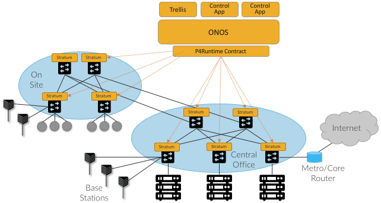

Chapter 6:  Exemplar Implementation
===================================

The steps we’ve taken in the previous chapters to virtualize,
disaggregate, optimize, distribute, and slice the cellular network not
only help us understand the inner-workings of 5G, but they are also
necessary to reduce the entirety of the 5G cellular network to practice.
The goal is an implementation, which by definition, forces us to make
specific engineering choices. This chapter describes one set of
engineering choices that results in a running system. It should be
interpreted as an exemplar, for the sake of completeness, but not the
only possibility.

The system we describe is called CORD, which you will recall from the
Introduction is an acronym (**C**\ entral **O**\ ffice
**R**\ e-architected as a **D**\ atacenter). More concretely, CORD is a
blueprint for building a 5G deployment from commodity hardware and a
collection of open source software components. We call this
hardware/software combination a CORD POD, where the idea is to deploy a
POD at each edge site that is part of a cellular network. The following
describes CORD in terms of a set of engineering decisions. It is not a
substitute for detailed documentation for installing, developing, and
operating CORD, which can be found elsewhere:
https://guide.opencord.org.

.. note::
   As discussed in the Introduction, even though CORD includes “Central
   Office” in its name, a CORD POD is a general design, and not strictly
   limited to being deployed in a conventional Central Office.

Before getting into the specifics, it is important to understand that
CORD is a work-in-progress, with a sizable open source community
contributing to its code base. Many of the components are quite mature,
and currently running in operator trials and production networks. Others
(largely corresponding to the advanced capabilities described in the
previous chapter) are prototypes that run in “demonstration mode,” but
are not yet complete enough to be included in official releases. Also,
as outlined in the earlier discussion on deployment options, CORD starts
with a production-quality EPC that is being incrementally evolved into
its 5G counterpart. (This chapter uses the EPC-specific components for
illustrative purposes.)

6.1 Framework
-------------

:ref:`Figure 6.1 <fig-cord>` gives a schematic overview of a CORD POD. It
connects downstream to a set of DUs (and associated RUs), and upstream
to the rest of the Internet. Internally, it includes a set of commodity
servers (the figure shows four racks of three servers each, but the
design accommodates anywhere from a partial rack to 16 racks) and a set
of white-box switches arranged in a leaf-spine topology (the figure
shows two leaves and two spine switches, but the design allows anywhere
from a single switch to two leaf switches per rack and as many spine
switches as necessary to provide sufficient east-to-west bandwidth).

.. _fig-cord:
.. figure:: figures/Slide25.png 
    :width: 650px
    :align: center
	    
    Figure 6.1: CORD implementation of RAN and Mobile Core.

With respect to software, :ref:`Figure 6.1 <fig-cord>` shows a combination of
RAN (red) and Mobile Core (blue) components, plus the modules that
define the CORD platform (orange). We describe the platform components
later in this chapter, but you can think of them as collectively
implementing a multi-tenant cloud on top of which many different
scalable services can run. The RAN and Mobile Core are two such tenants.
The CORD platform can also host other edge services (which is one reason
CORD is built using cloud technology in the first place), but exactly
what other edge services might run on a given CORD POD is beyond the
scope of this book.

The RAN and Core related components are ones we’ve described in earlier
chapters. They include the Control and User planes of the CU and Mobile
Core, respectively, where to simplify the diagram, we show the SGW and
PGW merged into a single S/PGW. One aspect of Figure E that requires
further elaboration is how each of the RAN and Mobile Core components
are actually realized. There are three different manifestations of the
functional components implied by the Figure: (1) the data plane layer of
the CU-U and S/PGW-U are realized as P4 programs loaded into the
programmable switches; (2) the control plane layer of the CU-U and
S/PGW-U (as well as the Trellis platform module) are realized as control
applications loaded onto the ONOS Network OS; and the remaining
components are realized as Kubernetes-managed microservices. (Kubernetes
is implicit, and not shown in the figure.)

To expand on this idea, :ref:`Figure 6.2 <fig-ci-cd>` gives an alternative
view of a CORD POD, abstracting away the details of *what* services it
hosts, and focusing instead on *how* those services are instantiated on
the POD. In this figure, all the functionality instantiated onto the POD
runs as a combination of Kubernetes-based microservices and ONOS-based
control applications.

.. _fig-ci-cd:
.. figure:: figures/Slide26.png 
    :width: 350px
    :align: center

    Figure 6.2: Alternative view of CORD, with a CI/CD toolchain
    managing the platform and set of services implemented by a
    combination of ONOS-based control apps and Kubernetes-based
    microservices.

When abstracted in this way, we can view a POD as including three major
subsystems:

-  **Platform:** The base layer common to all configurations includes
   Kubernetes as the container management system and ONOS as the SDN
   controller, with Stratum loaded on to each switch. Both ONOS and the
   control applications it hosts run as a Kubernetes-managed
   microservices.

-  **Profile:** The deployment-specific collection of microservices and
   SDN control apps that have been selected to run on a particular POD.
   This is a variable and evolvable set, and it includes the control
   plane and edge services described elsewhere.

-  **CI/CD Toolchain:** Used to assemble, deploy, operate, and upgrade a
   particular Platform/Profile combination. It implements a set of
   processes that transforms a collection of disaggregated and
   virtualized components into an operational system capable of
   responding to operator directives and carrying live traffic.

Although beyond the scope of this book, the CI/CD toolchain uses
standard DevOps tools to bootstrap software onto the cluster of servers
and switches, and rollout/rollback individual microservices and control
applications. It also auto-generates the Northbound Interface (NBI) that
operators use to manage the POD, based on a declarative specification of
the Profile the POD is configured to support. This NBI is sufficiently
complete to operate a CORD POD in a production environment.

6.2 Platform Components
-----------------------

We now return to the three platform-related components shown in `Figures
:ref:`Figure 6.1 <fig-cord>` and :ref:`6.2 <fig-ci-cd>`. Each is a
substantial open source component in its own right, but for our
purposes, it is enough to understand the role each plays in supporting
a 5G-based profile of CORD.

-  **Stratum:** A thin operating system that runs locally on each
   white-box switch. It’s purpose is to provide a hardware-independent
   interface for managing and programming the switches in CORD. This
   includes using *P4* to define the forwarding behavior of the switch’s
   forwarding pipeline (think of this program as a contract between the
   control and data planes), and *P4Runtime* to control that forwarding
   contract at runtime.

-  **ONOS:** A Network Operating System used to configure and control a
   network of programmable white-box switches. It runs off-switch as a
   logically centralized SDN controller, and hosts a collection of SDN
   control applications, each of which controls some aspect of the
   underlying network. Because it is logically centralized, ONOS is
   designed to be highly available and to have scalable performance.

-  **Trellis:** An ONOS-hosted SDN control application that implements a
   leaf-spine fabric on a network of white-box switches. It implements
   the control plane for several features, including VLANs and L2
   bridging, IPv4 and IPv6 unicast and multicast routing, DHCP L3 relay,
   dual-homing of servers and upstream routers, QinQ
   forwarding/termination, MPLS pseudowires, and so on. In addition,
   Trellis can make the entire fabric appear as a single (virtual)
   router to upstream routers, which communicate with Trellis using
   standard BGP.

Stratum (running on each switch) and ONOS (running off-switch and
managing a network of switches) communicate using the following
interfaces:

-  **P4:** Defines the forwarding behavior for programmable switching
   chips as well as model fixed-function ASIC pipelines. A P4 program
   defines a contract that is implemented by the data plane and
   programmable by the control plane.

-  **P4Runtime:** An SDN-ready interface for controlling forwarding
   behavior at runtime. It is the key for populating forwarding tables
   and manipulating forwarding state, and it does so in a P4 program and
   hardware agnostic way.

-  **OpenConfig Models:** Define a base for device configuration and
   management. These models can be programmatically extended for
   platform-specific functionality, but the goal is to minimize model
   deviations so as to enable a vendor-agnostic management plane.

-  **gNMI** (gRPC Network Management Interface): Improves on the
   existing configuration interfaces by using a binary representation on
   the wire and enabling bi-directional streaming. Paired with the
   OpenConfig models, gNMI is SDN-ready.

-  **gNOI** (gRPC Network Operations Interfaces): A collection of
   microservices that enable switch specific operations, like
   certificate management, device testing, software upgrade, and
   networking troubleshooting. gNOI provides a semantically rich API
   that replaces existing CLI-based approaches.

Trellis, as an SDN control application running on top of ONOS, controls
packet forwarding across the switching fabric internal to a CORD POD
(i.e., within a single site). But Trellis can also be extended across
multiple sites deeper into the network using multiple stages of spines,
as shown in :ref:`Figure 6.3 <fig-trellis>`. This means Trellis has the
potential to play a role in implementing the backhaul and midhaul
network for the RAN, or alternatively, extending the RAN into customer
premises (denoted “On Site” in the figure).

.. _fig-trellis:

    Figure 6.3: Trellis control application managing a (possibly
    distributed) leaf-spine fabric.
