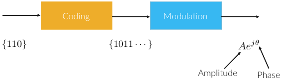
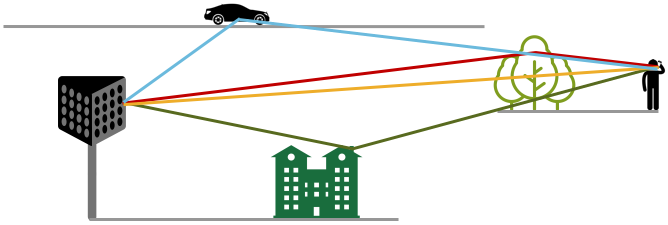
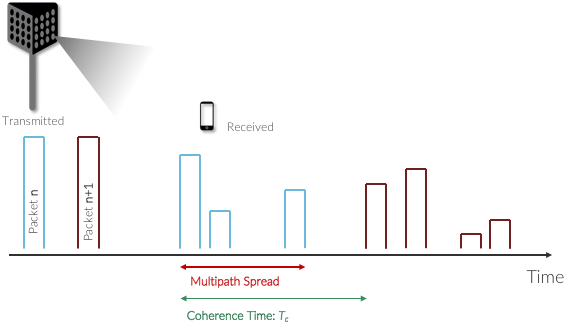
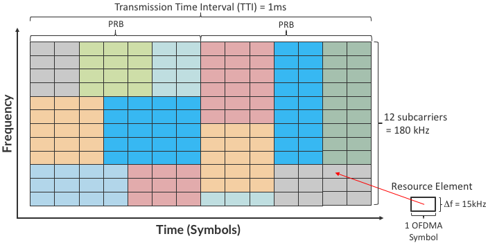
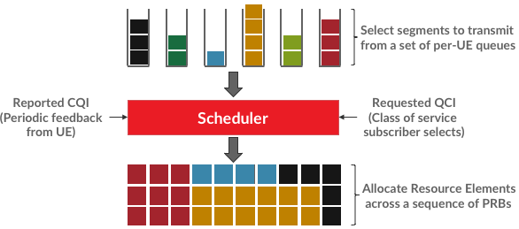

Chapter 2:  Radio Transmission
=================================

For anyone familiar with wireless access technologies like Wi-Fi, the
cellular network is most unique due to its approach to sharing the
available radio spectrum among its many users, all the while allowing
those users to remain connected while moving. This has resulted in a
highly dynamic and adaptive approach, in which coding, modulation and
scheduling play a central role.

As we will see in this chapter, cellular networks use a
reservation-based strategy, whereas Wi-Fi is contention-based. This
difference is rooted in each system’s fundamental assumption about
utilization: Wi-Fi assumes a lightly loaded network (and hence
optimistically transmits when the wireless link is idle and backs off if
contention is detected), while 4G and 5G cellular networks assume (and
strive for) high utilization (and hence explicitly assign different
users to different “shares” of the available radio spectrum).

We start by giving a short primer on radio transmission as a way of
laying a foundation for understanding the rest of the 5G architecture.
The following is not a substitute for a theoretical treatment of the topic,
but is instead intended as a way of grounding the systems-oriented
description of 5G that follows in the reality of wireless communication.

2.1 Coding and Modulation
-------------------------

The mobile channel over which digital data needs to be reliably
transmitted brings a number of impairments, including noise,
attenuation, distortion, fading, and interference. This challenge is
addressed by a combination of coding and modulation, as depicted in
:numref:`Figure %s <fig-modulation>`.

.. _fig-modulation:

    The role of coding and modulation in mobile communication.
     
At its core, coding inserts extra bits into the data to help recover
from all the environmental factors that interfere with signal
propagation. This typically implies some form of *Forward Error
Correction* (e.g., turbo codes, polar codes). Modulation then
generates signals that represent the encoded data stream, and it does
so in a way that matches the channel characteristics: It first uses a
digital modulation signal format that maximizes the number of reliably
transmitted bits every second based on the specifics of the observed
channel impairments; it next matches the transmission
bandwidth to channel bandwidth using pulse shaping; and finally, it
uses RF modulation to transmit the signal as an electromagnetic wave
over an assigned *carrier frequency.*

For a deeper appreciation of the challenges of reliably transmitting
data by propagating radio signals through the air, consider the
scenario depicted in :numref:`Figure %s <fig-multipath>`, where
the signal bounces off various stationary and moving objects,
following multiple paths from the transmitter to the receiver, who may
also be moving.

.. _fig-multipath:

    Signals propagate along multiple paths from
    transmitter to receiver.

As a consequence of these multiple paths, the original signal arrives at
the receiver spread over time, as illustrated in
:numref:`Figure %s <fig-coherence>`. Empirical evidence shows that the
Multipath Spread—the time between the first and last signals of one
transmission arriving at the receiver—is 1-10μs in urban
environments and 10-30μs in suburban environments. These multipath
signals can interfere with each other constructively or destructively,
and this will vary over time. Theoretical
bounds for the time duration for which the channel may be assumed to
be invariant, known as the *Coherence Time* and denoted
:math:`T_c`, is given by

.. math::
   T_c =c/v \times 1/f

where :math:`c` is the velocity of the signal, :math:`v` is the
velocity of the receiver (e.g., moving car or train), and :math:`f` is
the frequency of the carrier signal that is being modulated. This
says the coherence time is inversely proportional to the frequency of
the signal and the speed of movement, which makes intuitive sense: The
higher the frequency (narrower the wave) the shorter the coherence time,
and likewise, the faster the receiver is moving the shorter the coherence
time. Based on the target parameters to this model (selected according
to the target physical environment), it is possible to calculate
:math:`T_c`, which in turn bounds the rate at which symbols can be
transmitted without undue risk of interference. The dynamic nature of
the wireless channel is a central challenge to address in the cellular
network.  

.. _fig-coherence:

    Received data spread over time due to multipath
    variation.

To complicate matters further,    
:numref:`Figure %s <fig-multipath>` and :numref:`%s <fig-coherence>` imply
the transmission originates from a single
antenna, but cell towers are equipped with an array of antennas, each
transmitting in a different (but overlapping) direction. This
technology, called *Multiple-Input-Multiple-Output (MIMO)*, opens the
door to purposely transmitting data from multiple antennas in an effort
to reach the receiver, adding even more paths to the environment-imposed
multipath propagation.

One of the most important consequences of these factors is that the
transmitter must receive feedback from every receiver to judge how to
best utilize the wireless medium on their behalf. 3GPP specifies a
*Channel Quality Indicator (CQI)* for this purpose, where in practice
the receiver sends a CQI status report to the base station periodically
(e.g., every millisecond in LTE). These CQI messages report the observed
signal-to-noise ratio, which impacts the receiver’s ability to recover
the data bits. The base station then uses this information to adapt how
it allocates the available radio spectrum to the subscribers it is
serving, as well as which coding and modulation scheme to employ.
All of these decisions are made by the scheduler.

2.2 Scheduler
------------------

How the scheduler does its job is one of the most important properties
of each generation of the cellular network, which in turn depends on
the multiplexing mechanism. For example, 2G used *Time Division
Multiple Access (TDMA)* and 3G used *Code Division Multiple Access
(CDMA)*. How data is multiplexed is also a major differentiator for 4G
and 5G, completing the transition from the cellular network being
fundamentally circuit-switched to fundamentally packet-switched.

Both 4G and 5G are based on *Orthogonal Frequency-Division
Multiplexing (OFDM)*, an approach that multiplexes data over multiple
orthogonal subcarrier frequencies, each of which is modulated
independently. The value and efficiency of OFDM is in how it selects
subcarrier frequencies so as to avoid interference, that is, how it
achieves orthogonality. That topic is beyond the scope of this book.
We instead take a decidedly abstract perspective of multiplexing,
focusing on "discrete schedulable units of the radio spectrum" rather
than the signalling and modulation underpinnings that yield those
schedulable units.

To start, we drill down on these schedulable units. We return to the
broader issue of the *air interface* that makes efficient use of the
spectrum in the concluding section.

Multiplexing in 4G
~~~~~~~~~~~~~~~~~~

The 4G approach to multiplexing downstream transmissions is called
*Orthogonal Frequency-Division Multiple Access (OFDMA)*, a specific
application of OFDM that multiplexes data over a set of 12 orthogonal
subcarrier frequencies, each of which is modulated independently.\ [#]_ The
“Multiple Access” in OFDMA implies that data can simultaneously be
sent on behalf of multiple users, each on a different subcarrier
frequency and for a different duration of time. The subbands are
narrow (e.g., 15 kHz), but the coding of user data into OFDMA symbols
is designed to minimize the risk of data loss due to interference
between adjacent bands.

.. [#] 4G uses a different multiplexing strategy for upstream
       transmissions (from user devices to base stations), but we do
       not describe it because the approach is not applicable to 5G.

The use of OFDMA naturally leads to conceptualizing the radio spectrum
as a 2-D resource, as shown in :numref:`Figure %s <fig-sched-grid>`.
The minimal schedulable unit, called a *Resource Element (RE)*,
corresponds to a 15-kHz band around one subcarrier frequency and the
time it takes to transmit one OFDMA symbol. The number of bits that can
be encoded in each symbol depends on the modulation rate, so for example
using *Quadrature Amplitude Modulation (QAM)*, 16-QAM yields 4 bits per
symbol and 64-QAM yields 6 bits per symbol.

.. _fig-sched-grid:

	    
    Spectrum abstractly represented by a 2-D grid of
    schedulable Resource Elements.

A scheduler allocates some number of REs to each user that has data to
transmit during each 1 ms *Transmission Time Interval (TTI)*, where users
are depicted by different colored blocks in :numref:`Figure %s <fig-sched-grid>`.
The only constraint on the scheduler is that it must make its allocation
decisions on blocks of 7x12=84 resource elements, called a *Physical
Resource Block (PRB)*. :numref:`Figure %s <fig-sched-grid>` shows two
back-to-back PRBs. Of course time continues to flow along one axis, and
depending on the size of the available frequency band (e.g., it might be
100 MHz wide), there may be many more subcarrier slots (and hence PRBs)
available along the other axis, so the scheduler is essentially
preparing and transmitting a sequence of PRBs.

Note that OFDMA is not a coding/modulation algorithm, but instead
provides a framework for selecting a specific coding and modulator for
each subcarrier frequency. QAM is one common example modulator. It is
the scheduler’s responsibility to select the modulation to use for each
PRB, based on the CQI feedback it has received. The scheduler also
selects the coding on a per-PRB basis, for example, by how it sets the
parameters to the turbo code algorithm.

The 1-ms TTI corresponds to the time frame in which the scheduler
receives feedback from users about the quality of the signal they are
experiencing. This is the CQI mentioned earlier, where once every
millisecond, each user sends a set of metrics, which the scheduler uses
to make its decision as to how to allocate PRBs during the subsequent
TTI.

Another input to the scheduling decision is the *QoS Class Identifier
(QCI)*, which indicates the quality-of-service each class of traffic is
to receive. In 4G, the QCI value assigned to each class (there are nine
such classes, in total) indicates whether the traffic has a *Guaranteed
Bit Rate (GBR)* or not *(non-GBR)*, plus the class’s relative priority
within those two categories.

Finally, keep in mind that :numref:`Figure %s <fig-sched-grid>` focuses on
scheduling transmissions from a single antenna, but the MIMO technology
described above means the scheduler also has to determine which antenna
(or more generally, what subset of antennas) will most effectively reach
each receiver. But again, in the abstract, the scheduler is charged with
allocating a sequence of Resource Elements.

This all raises the question: How does the scheduler decide which set of
users to service during a given time interval, how many resource
elements to allocate to each such user, how to select the coding and
modulation levels, and which antenna to transmit their data on? This is
an optimization problem that, fortunately, we are not trying to solve
here. Our goal is to describe an architecture that allows someone else
to design and plug in an effective scheduler. Keeping the cellular
architecture open to innovations like this is one of our goals, and as
we will see in the next section, becomes even more important in 5G where
the scheduler operates with even more degrees of freedom.

Multiplexing in 5G
~~~~~~~~~~~~~~~~~~

The transition from 4G to 5G introduces additional flexibility in
how the radio spectrum is scheduled, making it possible to adapt the
cellular network to a more diverse set of devices and applications
domains.

Fundamentally, 5G defines a family of waveforms—unlike LTE, which
specified only one waveform—each optimized for a different band in the
radio spectrum.\ [#]_  The bands with carrier frequencies below 1 GHz are
designed to deliver mobile broadband and massive IoT services with a
primary focus on range. Carrier frequencies between 1-6 GHz are
designed to offer wider bandwidths, focusing on mobile broadband and
mission-critical applications. Carrier frequencies above 24 GHz
(mmWaves) are designed to provide super wide bandwidths over short,
line-of-sight coverage.

.. [#] A waveform is the frequency, amplitude, and phase-shift
   independent property (shape) of a signal. A sine wave is an example
   waveform.

These different waveforms affect the scheduling and subcarrier intervals
(i.e., the “size” of the resource elements described in the previous
section).

-  For sub-1 GHz bands, 5G allows maximum 50 MHz bandwidths. In this case,
   there are two waveforms: one with subcarrier spacing of 15 kHz and
   another of 30 kHz. (We used 15 kHz in the example shown in
   :numref:`Figure %s <fig-sched-grid>`.)
   The corresponding scheduling intervals are
   0.5 and 0.25 ms, respectively. (We used 0.5 ms in the example shown
   in :numref:`Figure %s <fig-sched-grid>`.)

-  For 1-6 GHz bands, maximum bandwidths go up to 100 MHz.
   Correspondingly, there are three waveforms with subcarrier spacings
   of 15, 30 and 60 kHz, corresponding to scheduling intervals of
   0.5, 0.25, and 0.125 ms, respectively.

-  For millimeter bands, bandwidths may go up to 400 MHz. There are two
   waveforms, with subcarrier spacings of 60 kHz and 120 kHz. Both have
   scheduling intervals of 0.125 ms.

These various configurations of subcarrier spacing and scheduling
intervals are sometimes called the *numerology* of the radio's air
interface.

This range of numerology is important because it adds another degree
of freedom to the scheduler. In addition to allocating radio resources
to users, it has the ability to dynamically adjust the size of the
resource by changing the wave form being used. With this additional
freedom, fixed-sized REs are no longer the primary unit of resource
allocation.  We instead use more abstract terminology, and talk about
allocating *Resource Blocks* to subscribers, where the 5G scheduler
determines both the size and number of Resource Blocks allocated
during each time interval.

:numref:`Figure %s <fig-scheduler>` depicts the role of the scheduler
from this more abstract perspective, where just as with 4G, CQI
feedback from the receivers and the QCI quality-of-service class
selected by the subscriber are the two key pieces of input to the
scheduler. Note that the set of QCI values changes between 4G and 5G,
reflecting the increasing differentiation being supported. For 5G,
each class includes the following attributes:

-  Resource Type: Guaranteed Bit Rate (GBR), Delay-Critical GBR, Non-GBR
-  Priority Level
-  Packet Delay Budget
-  Packet Error Rate
-  Averaging Window
-  Maximum Data Burst

Note that while the preceding discussion could be interpreted to imply a
one-to-one relationship between subscribers and a QCI, it is more
accurate to say that each QCI is associated with a class of traffic
(often corresponding to some type of application), where a given
subscriber might be sending and receiving traffic that belongs to
multiple classes at any given time. We explore this idea in much more
depth in a later chapter.

.. _fig-scheduler:

    Scheduler allocates Resource Blocks to user data streams based on
    CQI feedback from receivers and the QCI parameters associated with
    each class of service.

2.3 New Radio (NR)
------------------

We conclude by noting that while the previous section describes 5G as
introducing additional degrees of freedom into how data is scheduled
for transmission, the end result is a qualitatively more powerful
radio. This new 5G air interface specification, which is commonly
referred to as *New Radio (NR)*, enables three new use cases that go
well beyond simply delivering increased bandwidth:

* Extreme Mobile Broadband
* Ultra-Reliable Low-Latency Communications
* Massive Machine-Type Communications

All three correspond to the requirements introduced in Chapter 1, and
can be attributed to four fundamental improvements in how 5G
multiplexes data onto the radio spectrum.

The first is the one identified in the previous section: being able to
change the waveform. This effectively introduces the ability to
dynamically change the size and number of schedulable resource units,
which opens the door to making fine-grain scheduling decisions that
are critical to predictable, low-latency communication.

The second is related to the "Multiple Access" aspect of how distinct
traffic sources are multiplexed onto the available spectrum. In 4G,
multiplexing happens in both the frequency and time domains for
downstream traffic (as described in Section 2.2), but multiplexing
happens in only the frequency domain for upstream traffic. 5G NR
multiplexes both upstream and downstream traffic in both the time and
frequency domains. Doing so provides finer-grain scheduling control
needed by latency-sensitive applications.

The third is related to the new spectrum available to 5G NR, with the
mmWave allocations opening above 24 GHz being especially
important. This is not only because of the abundance of capacity—which
makes it possible to set aside dedicated capacity for mission-critical
applications that require low-latency communication—but also because
the higher-frequency enables even finer-grain resource blocks (e.g.,
scheduling intervals as short as 0.125 ms). Again, this improves
scheduling granularity to the benefit of applications that cannot
tolerate unpredictable latency.

The fourth is related to delivering mobile connectivity to a massive
number of IoT devices, ranging from devices that require mobility
support and modest data rates (e.g. wearables, asset trackers) to
devices that support intermittent transmission of a few bytes of data
(e.g., sensors, meters). None of these devices are particularly
latency-sensitive or bandwidth-hungry, but the latter are especially
challenging because they require long battery lifetimes, and hence,
reduced hardware complexity that draws less power.

Support for IoT device connectivity revolves around allocating some of
the available radio spectrum to a light-weight (simplified) air
interface.  This approach started with Release 13 of LTE via two
complementary technologies: mMTC and NB-IoT (NarrowBand-IoT).  Both
technologies build on a significantly simplified version of LTE—i.e.,
limiting the numerology and flexibility needed achieve high spectrum
utilization—so as to allow for simpler IoT hardware design. mMTC
delivers up to 1 Mbps over a 1.4 MHz of bandwidth and NB-IoT delivers a
few tens of kbps over 200 kHz of bandwidth; hence the term
*NarrowBand*.  Both technologies have been designed to support over 1
million devices per square kilometer. With Release 16, both
technologies can be operated in-band with 5G, but still based on LTE
numerology. Starting with Release 17, a simpler version of 5G NR,
called *NR-Light*, will be introduced as the evolution of mMTC.
NR-Light is expected to scale the device density even further.

As a consequence of all four improvements, 5G NR is designed to
support partitioning the available bandwidth, with different
partitions dynamically allocated to different classes of traffic
(e.g., high-bandwidth, low-latency, and low-complexity). This is the
essence of *slicing*, an idea we will revisit throughout this book.
Moreover, once traffic with different requirements can be served by
different slices, 5G NR's approach to multiplexing is general enough
to support varied scheduling decisions for those slices, each tailored
for the target traffic.

