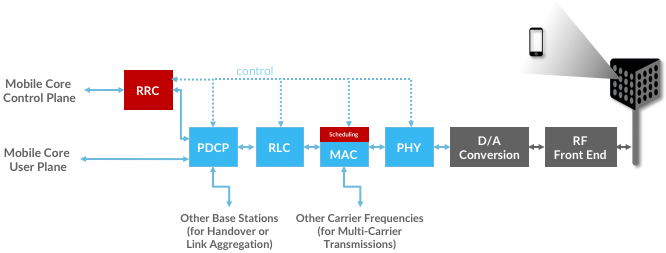
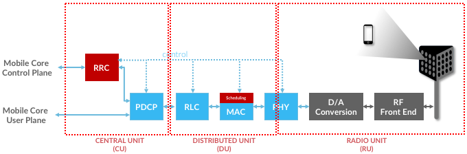
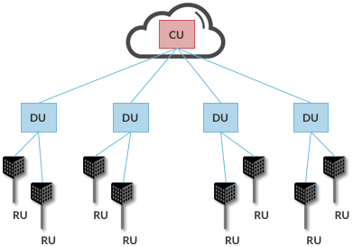
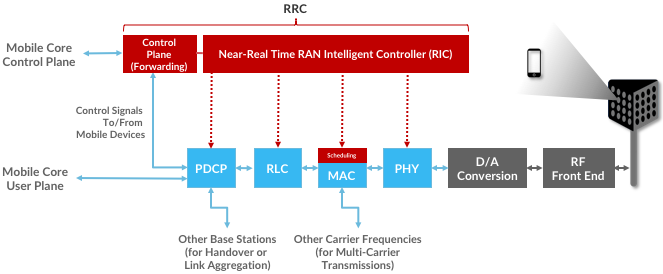
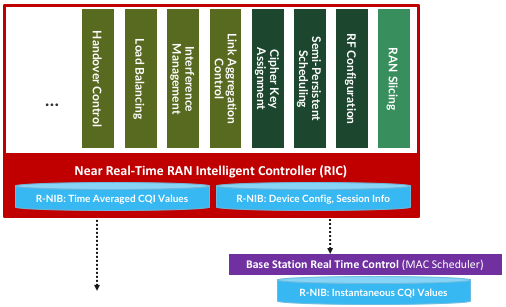

Chapter 4:  RAN Internals
=========================

The description of the RAN in the previous chapter focused on
functionality, but was mostly silent about the RAN’s internals
structure. We now focus in on some of the internal details, and in doing
so, explain how the RAN is being transformed in 5G. This involves first
describing the stages in the packet processing pipeline, and then
showing how these stages can be distributed and implemented.

4.1 Packet Processing Pipeline
------------------------------

:ref:`Figure 4.1 <fig-pipeline>` shows the packet processing stages
implemented by the base station. These stages are specified by the 3GPP
standard. Note that the figure depicts the base station as a pipeline
(running left-to-right) but it is equally valid to view it as a protocol
stack (as is typically done in official 3GPP documents). Also note that
(for now) we are agnostic as to how these stages are implemented, but
since we are ultimately heading towards a cloud-based implementation,
you can think of each as corresponding to a microservice (if that is
helpful).

.. _fig-pipeline:

	    
    Figure 4.1: RAN processing pipeline, including both user and
    control plane components.

The key stages are as follows:

-  RRC (Radio Resource Control) → Responsible for configuring the
   coarse-grain and policy-related aspects of the pipeline. The RRC runs
   in the RAN’s control plane; it does not process packets on the user
   plane.

-  PDCP (Packet Data Convergence Protocol) → Responsible for compressing
   and decompressing IP headers, ciphering and integrity protection, and
   making an “early” forwarding decision (i.e., whether to send the
   packet down the pipeline to the UE or forward it to another base
   station).

-  RLC (Radio Link Control) → Responsible for segmentation and
   reassembly, including reliably transmitting/receiving segments by
   implementing ARQ.

-  MAC (Media Access Control) → Responsible for buffering, multiplexing
   and demultiplexing segments, including all real-time scheduling
   decisions about what segments are transmitted when. Also able to make
   a “late” forwarding decision (i.e., to alternative carrier
   frequencies, including Wi-Fi).

-  PHY (Physical Layer) → Responsible for coding and modulation (as
   discussed in an earlier chapter), including FEC.

The last two stages in :ref:`Figure 4.1 <fig-pipeline>` (D/A
conversion and the RF front-end) are beyond the scope of this book.

While it is simplest to view the stages in :ref:`Figure 4.1 <fig-pipeline>`
as a pure left-to-right pipeline, in practice the Scheduler running in the
MAC stage implements the “main loop” for outbound traffic, reading data
from the upstream RLC and scheduling transmissions to the downstream
PHY. In particular, since the Scheduler determines the number of bytes
to transmit to a given UE during each time period (based on all the
factors outlined in an earlier chapter), it must request (get) a segment
of that length from the upstream queue. In practice, the size of the
segment that can be transmitted on behalf of a single UE during a single
scheduling interval can range from a few bytes to an entire IP packet.

4.2 Split RAN
-------------

The next step is understanding how the functionality outlined above is
partitioned between physical elements, and hence, “split” across
centralized and distributed locations. Although the 3GPP standard allows
for multiple split-points, the partition shown in :ref:`Figure 4.2 <fig-split-ran>`
is the one being actively pursued by the
operator-led O-RAN (Open RAN) Alliance. It is the split we adopt
throughout the rest of this book.

.. _fig-split-ran:

    Figure 4.2: Split-RAN processing pipeline distributed across a
    Central Unit (CU), Distributed Unit (DU), and Radio Unit (RU).

This results in a RAN-wide configuration similar to that shown in
:ref:`Figure 4.3 <fig-ran-hierarchy>`, where a single *Central Unit (CU)*
running in the cloud serves multiple *Distributed Units (DUs)*, each of
which in turn serves multiple *Radio Units (RUs)*. Critically, the RRC
(centralized in the CU) is responsible for only near-real time
configuration and control decision making, while the Scheduler that is
part of the MAC stage is responsible for all real-time scheduling
decisions.

.. _fig-ran-hierarchy:

	    
    Figure 4.3: Split-RAN hierarchy, with one CU serving multiple DUs,
    each of which serves multiple RUs.

Clearly, a DU needs to be “near” (within 1ms) the RUs it manages since
the MAC schedules the radio in real-time. One familiar configuration is
to co-locate a DU and an RU in a cell tower. But when an RU corresponds
to a small cell, many of which might be spread across a modestly sized
geographic area (e.g., a mall, campus, or factory), then a single DU
would likely service multiple RUs. The use of mmWave in 5G is likely to
make this later configuration all the more common.

Also note that the split-RAN changes the nature of the Backhaul Network,
which in 4G connected the base stations (eNBs) back to the Mobile Core.
With the split-RAN there are multiple connections, which are officially
labelled as follows:

-  RU-DU connectivity is called the Fronthaul
-  DU-CU connectivity is called the Midhaul
-  CU-Mobile Core connectivity is called the Backhaul

As we will see in a later chapter, one possible deployment co-locates
the CU and Mobile Core in the same cluster, meaning the backhaul is
implemented in the cluster switching fabric. In such a configuration,
the midhaul then effectively serves the same purpose as the original
backhaul, and the fronthaul is constrained by the
predictable/low-latency requirements of the MAC stage’s real-time
scheduler.

4.3 Software-Defined RAN
------------------------

Finally, we describe how the RAN is implemented according to SDN
principles, resulting in an SD-RAN. The key architectural insight is
shown in :ref:`Figure 4.4 <fig-rrc-split>`, where the RRC from
:ref:`Figure 4.1 <fig-pipeline>` is partitioned into two
sub-components: the one on
the left provides a 3GPP-compliant way for the RAN to interface to the
Mobile Core’s control plane, while the latter opens a new programmatic
API for exerting software-based control over the pipeline that
implements the RAN user plane. To be more specific, the left
sub-component simply forwards control packets between the Mobile Core
and the PDCP, providing a path over which the Mobile Core can
communication with the UE for control purposes, whereas the right
sub-component implements the core of the RCC’s control functionality.

.. _fig-rrc-split:

	    
    Figure 4.4: RRC disaggregated into a Mobile Core facing control
    plane component and a Near Real-Time Controller.

Although not shown in :ref:`Figure 4.4 <fig-rrc-split>`, keep in mind
(from :ref:`Figure 4.2 <fig-split-ran>`) that all constituent parts of
the RRC, plus the PDCP, form the CU.

Completing the picture, :ref:`Figure 4.5 <fig-ran-controller>` shows
the Near-RT RAN Controller implemented as a traditional SDN Controller
hosting a set of SDN control apps. The Near Real-Time Controller
maintains a RAN Network Information Base (R-NIB) that includes
time-averaged CQI values and other per-session state (e.g., GTP tunnel
IDs, QCI values for the type of traffic), while the MAC (as part of the
DU) maintains the instantaneous CQI values required by the real-time
scheduler. Specifically, the R-NIB includes the following state:

-  NODES: Base Stations and Mobile Devices

   -  Base Station Attributes:

      -  Identifiers
      -  Version
      -  Config Report
      -  RRM config
      -  PHY resource usage

   -  Mobile Device Attributes:

      -  Identifiers
      -  Capability
      -  Measurement Config
      -  State (Active/Idle)

-  LINKS: Physical between two nodes and potential between UEs and all
   neighbor cells

   -  Link Attributes:

      -  Identifiers
      -  Link Type
      -  Config / Bearer Parameters
      -  QCI Value

-  SLICES: Virtualized RAN construct

   -  Slice Attributes:

      -  Links
      -  Bearers / Flows
      -  Validity Period
      -  Desired KPIs
      -  MAC RRM Configuration
      -  RRM Control Configuration

.. _fig-ran-controller:

	    
    Figure 4.5: Example set of control applications running on top of
    Near Real-Time RAN Controller.

The example Control Apps in :ref:`Figure 4.5 <fig-ran-controller>`
include a
range of possibilities, but is not intended to be an exhaustive list.
The right-most example, RAN Slicing, is the most ambitious in that it
introduces a new capability: Virtualizing the RAN. It is also an idea
that has been implemented, which we describe in more detail in the next
chapter.

The next three (RF Configuration, Semi-Persistent Scheduling, Cipher Key
Assignment) are examples of configuration-oriented applications. They
provide a programmatic way to manage seldom-changing configuration
state, thereby enabling zero-touch operations. Coming up with meaningful
policies (perhaps driven by analytics) is likely to be an avenue for
innovation in the future.
