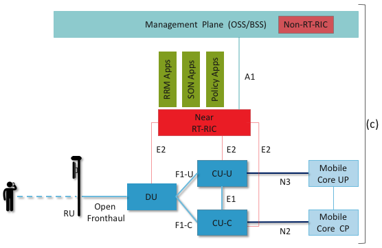

Chapter 4:  RAN Internals
=========================

The description of the RAN in the previous chapter focused on
functionality, but was mostly silent about the RAN’s internals
structure. We now focus in on some of the internal details, and in doing
so, explain how the RAN is being transformed in 5G. This involves first
describing the stages in the packet processing pipeline, and then
showing how these stages can be distributed and implemented.

4.1 Packet Processing Pipeline
------------------------------

:numref:`Figure %s <fig-pipeline>` shows the packet processing stages
implemented by the base station. These stages are specified by the 3GPP
standard. Note that the figure depicts the base station as a pipeline
(running left-to-right) but it is equally valid to view it as a protocol
stack (as is typically done in official 3GPP documents). Also note that
(for now) we are agnostic as to how these stages are implemented, but
since we are ultimately heading towards a cloud-based implementation,
you can think of each as corresponding to a microservice (if that is
helpful).

.. _fig-pipeline:
.. figure:: figures/Slide14.png 
    :width: 600px
    :align: center
	    
    RAN processing pipeline, including both user and
    control plane components.

The key stages are as follows:

-  RRC (Radio Resource Control) → Responsible for configuring the
   coarse-grain and policy-related aspects of the pipeline. The RRC runs
   in the RAN’s control plane; it does not process packets on the user
   plane.

-  PDCP (Packet Data Convergence Protocol) → Responsible for compressing
   and decompressing IP headers, ciphering and integrity protection, and
   making an “early” forwarding decision (i.e., whether to send the
   packet down the pipeline to the UE or forward it to another base
   station).

-  RLC (Radio Link Control) → Responsible for segmentation and
   reassembly, including reliably transmitting/receiving segments by
   implementing ARQ.

-  MAC (Media Access Control) → Responsible for buffering, multiplexing
   and demultiplexing segments, including all real-time scheduling
   decisions about what segments are transmitted when. Also able to make
   a “late” forwarding decision (i.e., to alternative carrier
   frequencies, including Wi-Fi).

-  PHY (Physical Layer) → Responsible for coding and modulation (as
   discussed in an earlier chapter), including FEC.

The last two stages in :numref:`Figure %s <fig-pipeline>` (D/A
conversion and the RF front-end) are beyond the scope of this book.

While it is simplest to view the stages in :numref:`Figure %s <fig-pipeline>`
as a pure left-to-right pipeline, in practice the Scheduler running in the
MAC stage implements the “main loop” for outbound traffic, reading data
from the upstream RLC and scheduling transmissions to the downstream
PHY. In particular, since the Scheduler determines the number of bytes
to transmit to a given UE during each time period (based on all the
factors outlined in an earlier chapter), it must request (get) a segment
of that length from the upstream queue. In practice, the size of the
segment that can be transmitted on behalf of a single UE during a single
scheduling interval can range from a few bytes to an entire IP packet.

4.2 Split RAN
-------------

The next step is to understand how the functionality outlined above is
partitioned between physical elements, and hence, “split” across
centralized and distributed locations. The dominant option has
historically been "no split," with the entire pipeline shown in
:numref:`Figure %s <fig-pipeline>` running in the base station.  Going
forward, the 3GPP standard has been extended to allow for multiple
split-points, with the partition shown in :numref:`Figure %s
<fig-split-ran>` being actively pursued by the operator-led O-RAN
(Open RAN) Alliance. It is the split we adopt throughout the rest of
this book.

.. _fig-split-ran:
.. figure:: figures/Slide15.png 
    :width: 600px
    :align: center

    Split-RAN processing pipeline distributed across a
    Central Unit (CU), Distributed Unit (DU), and Radio Unit (RU).

This results in a RAN-wide configuration similar to that shown in
:numref:`Figure %s <fig-ran-hierarchy>`, where a single *Central Unit (CU)*
running in the cloud serves multiple *Distributed Units (DUs)*, each of
which in turn serves multiple *Radio Units (RUs)*. Critically, the RRC
(centralized in the CU) is responsible for only near-real time
configuration and control decision making, while the Scheduler that is
part of the MAC stage is responsible for all real-time scheduling
decisions.

.. _fig-ran-hierarchy:
.. figure:: figures/Slide16.png 
    :width: 400px
    :align: center
	    
    Split-RAN hierarchy, with one CU serving multiple DUs,
    each of which serves multiple RUs.

Clearly, a DU needs to be “near” (within 1ms) the RUs it manages since
the MAC schedules the radio in real-time. One familiar configuration is
to co-locate a DU and an RU in a cell tower. But when an RU corresponds
to a small cell, many of which might be spread across a modestly sized
geographic area (e.g., a mall, campus, or factory), then a single DU
would likely service multiple RUs. The use of mmWave in 5G is likely to
make this later configuration all the more common.

Also note that the split-RAN changes the nature of the Backhaul Network,
which in 4G connected the base stations (eNBs) back to the Mobile Core.
With the split-RAN there are multiple connections, which are officially
labelled as follows:

-  RU-DU connectivity is called the Fronthaul
-  DU-CU connectivity is called the Midhaul
-  CU-Mobile Core connectivity is called the Backhaul

One observation about the CU (which is relevant in the next chapter)
is that one might co-locate the CU and Mobile Core in the same
cluster, meaning the backhaul is implemented in the cluster switching
fabric. In such a configuration, the midhaul then effectively serves
the same purpose as the original backhaul, and the fronthaul is
constrained by the predictable/low-latency requirements of the MAC
stage’s real-time scheduler.

A second observation about the CU shown in :numref:`Figure %s
<fig-split-ran>` is that it encompasses two functional blocks—the RRM
and the PDPC—which lie on the RAN's control plane and user plane,
respectively. This separation is consistent with the idea of CUPS
introduced in Chapter 3, and plays an increasingly important role as
we dig deeper into how the RAN is implemented. For now, we note that
the two parts are typically referred to as the CU-C and CU-U,
respectively.

.. _reading_backhaul:
.. admonition:: Further Reading

    For more insight into design considerations for
    interconnecting the distributed components of a Split RAN, see
    `RAN Evolution Project: Backhaul and Fronthaul Evolution
    <https://www.ngmn.org/wp-content/uploads/NGMN_RANEV_D4_BH_FH_Evolution_V1.01.pdf>`__.
    NGMN Alliance Report, March 2015.

4.3 Software-Defined RAN
------------------------

Finally, we describe how the RAN is implemented according to SDN
principles, resulting in an SD-RAN. The key architectural insight is
shown in :numref:`Figure %s <fig-rrc-split>`, where the RRC from
:numref:`Figure %s <fig-pipeline>` is partitioned into two
sub-components: the one on the left provides a 3GPP-compliant way for
the RAN to interface to the Mobile Core’s control plane, while the one
on the right opens a new programmatic API for exerting software-based
control over the pipeline that implements the RAN user plane.

To be more specific, the left sub-component simply forwards control
packets between the Mobile Core and the PDCP, providing a path over
which the Mobile Core can communicate with the UE for control
purposes, whereas the right sub-component implements the core of the
RCC’s control functionality. This component is commonly referred to as
the *RAN Intelligent Controller (RIC)* in O-RAN architecture
documents, so we adopt this terminology.  The "Near-Real Time"
qualifier indicates the RIC is part of 10-100ms control loop implemented
in the CU, as opposed to the ~1ms control loop required by the MAC
scheduler running in the DU.

.. _fig-rrc-split:
.. figure:: figures/Slide18.png 
    :width: 600px
    :align: center
	    
    RRC disaggregated into a Mobile Core facing control
    plane component and a Near Real-Time Controller.

Although not shown in :numref:`Figure %s <fig-rrc-split>`, keep in mind
(from :numref:`Figure %s <fig-split-ran>`) that all constituent parts of
the RRC, plus the PDCP, form the CU.

Completing the picture, :numref:`Figure %s <fig-ran-controller>` shows
the Near-RT RIC implemented as a traditional SDN Controller hosting a
set of SDN control apps. The RIC maintains a *RAN Network Information
Base (R-NIB)* that includes time-averaged CQI values and other
per-session state (e.g., GTP tunnel IDs, QCI values for the type of
traffic), while the MAC (as part of the DU) maintains the
instantaneous CQI values required by the real-time
scheduler. Specifically, the R-NIB includes the following state:

-  NODES: Base Stations and Mobile Devices

   -  Base Station Attributes:

      -  Identifiers
      -  Version
      -  Config Report
      -  RRM config
      -  PHY resource usage

   -  Mobile Device Attributes:

      -  Identifiers
      -  Capability
      -  Measurement Config
      -  State (Active/Idle)

-  LINKS: *Actual* between two nodes and *Potential* between UEs and all
   neighbor cells

   -  Link Attributes:

      -  Identifiers
      -  Link Type
      -  Config / Bearer Parameters
      -  QCI Value

-  SLICES: Virtualized RAN Construct

   -  Slice Attributes:

      -  Links
      -  Bearers / Flows
      -  Validity Period
      -  Desired KPIs
      -  MAC RRM Configuration
      -  RRM Control Configuration

.. _fig-ran-controller:
.. figure:: figures/Slide19.png 
    :width: 500px
    :align: center
	    
    Example set of control applications running on top of
    Near Real-Time RAN Controller.

The example Control Apps in :numref:`Figure %s <fig-ran-controller>`
include a range of possibilities, but is not intended to be an
exhaustive list.  The right-most example, RAN Slicing, is the most
ambitious in that it introduces a new capability: Virtualizing the
RAN. It is also an idea that has been implemented, which we describe
in more detail in the next chapter.

The next three (RF Configuration, Semi-Persistent Scheduling, Cipher Key
Assignment) are examples of configuration-oriented applications. They
provide a programmatic way to manage seldom-changing configuration
state, thereby enabling zero-touch operations. Coming up with meaningful
policies (perhaps driven by analytics) is likely to be an avenue for
innovation in the future.

The left-most four example Control Applications are the sweet spot for
SDN. These functions—Link Aggregation Control, Interference
Management, Load Balancing, and Handover Control—are currently
implemented by individual base stations with only local visibility,
but they have global consequenes. The SDN approach is to collect the
available input data centrally, make a globally optimal decision, and
then push the respective control parametes back to the base stations
for execution. Realizing this value in the RAN is still a
work-in-progress, but evidence using the same approach to optimize
wide-area networks is compelling.

Another common way to characterize this suite of Control Applications
for SD-RAN is based on the current practice of controling the mobile
link at two different levels. At the first level, per-node and
per-link control is conducted using Radio Resource Management (RRM)
functions that are distributed across the individual base stations.
RRM functions include scheduling, handover control, link and carrier
aggregation control, bearer control, and access control.  At the
second level, regional mobile network optimization and configuration
is conducted using *Self-Organizing Network (SON)* functions. These
functions oversee neighbor lists, manage load balancing, optimize
coverage and capacity, aim for network-wide interference mitigation,
centrally configure parameters, and so on. As a consequence of these
two levels of control, it is not uncommon to see reference to "RRM
Applications" and "SON Applications" in the context of SD-RAN.
  
.. _reading_b4:
.. admonition:: Further Reading

   For an example of how SDN principles have been successfully applied
   to a production network, we recommend `B4: Experience with a
   Globally-Deployed Software Defined WAN
   <https://cseweb.ucsd.edu/~vahdat/papers/b4-sigcomm13.pdf>`__.  ACM
   SICOMM, August 2013.

We conclude this introduction to SD-RAN by re-iterating the process of
disaggregation, which is being pursued in three tiers. In the first
tier, 3GPP standards provide multiple options of how horizontal RAN
disaggregation can take place. Horizontal disaggregation basically
splits the RAN protocol stack (shown as a pipeline in :numref:`Figure
%s <fig-pipeline>`) into independently operating components.
:numref:`Figure %s (a) <fig-disagg>` illustrates horizontal
disaggregation of the RAN into 3 distinct components: CU, DU and
RU. The O-RAN Alliance has selected specific disaggregation options
from 3GPP and is developing open interfaces between these components.
3GPP defines the **N2** and **N3** interfaces between the RAN and the
Mobile Core.

The second tier of disaggregation is vertical, focusing on
control/user plane separation (CUPS) of the CU, and resulting in CU-U
and CU-C shown in :numref:`Figure %s (b) <fig-disagg>`. Here, the
control plane in question is the 3GPP control plane, where the CU-U
realizes a pipeline for user traffic and the CU-C focuses on control
message signaling between mobile core and the disaggregated RAN
components (as well as to the UE). The O-RAN specified interfaces
between all disaggregated components are also shown in
:numref:`Figure %s (b) <fig-disagg>`.

The third tier follows the SDN paradigm by carrying vertical
disaggregation one step further. It does this by separating most of
RAN control (RRM functions) from the disaggregated RAN components, and
logically centralizing them as applications running on an SDN
Controller, which corresponds to the Near-RT RIC shown previously in
:numref:`Figures %s <fig-rrc-split>` and :numref:`Figures %s
<fig-ran-controller>`. This SDN-based vertical disaggregation is
repeated here in :numref:`Figure %s (c) <fig-disagg>`.  The figure
also shows the additional O-RAN prescribed interfaces.

The control of the mobile link has tight round-trip delay
requirements, and as such, not all RRM functions can be
centralized. After horizontal and vertical CUPS disaggregation, the
RRM functions are split between CU-C and DU. For this reason, the
SDN-based vertical disaggregation focuses on centralizing CU-C-side
RRM functions in the Near-RT RIC. In addition to RRM control, the RIC
enables a central platform for SON applications as well. It should be
noted that both RRM and SON-based control are effectively closed-loop
control, with the aim of maintaining acceptable network operation
despite stochastic variations on the mobile link.

The presence of Near RT-RIC also brings in the possibility of
developing policy-based RAN control, whereby interrupts to these
closed-loop RAN control based on operator policy become
possible. These policies need to be delivered to the Near RT-RIC from
the operator’s management plane. One can imagine developing
learning-based RRM, SON and Policy applications, in which case the
inference engines of these applications would run as Near RT-RIC
applications, and their non-real-time learning-counterparts would run
elsewhere. A Non-Real-Time RIC (Non-RT-RIC) may be developed to
interact with the Near-RT-RIC to enable proper operation of such
applications as well as ensuring delivery of relevant operator
policies from the Management Plane to the Near RT-RIC.

.. _fig-disagg:
.. figure:: figures/Slide40.png 
    :width: 500px 
    :align: center
	    

.. figure:: figures/Slide42.png 
    :width: 500px 
    :align: center
       
    RAN disaggregation tiers: (a) horizontal disaggregation, (b)
    vertical CUPS disaggregation, (c) vertical SDN disaggregation.

The interface names are cryptic, and knowing them adds nothing to our
conceptual understanding of the RAN, except perhaps to re-enforce how
challenging it is to introduce a transformative technology like
Software-Defined Networking into an operational environment that is
striving to achieve full backward compatibility and universal
interoperability. It is instructive to contrast this approach with the
Internet's philosophy of trying to minimize the universally agreed
upon definitions.

That said, we do call out two notable examples. The first is the
**A1** interface that the mobile operator's management plane—typically
called the *OSS/BSS (Operations Support System / Business Support
System)* in the Telco world—uses the to configure the RAN.  We have
not discussed the Telco OSS/BSS up to this point, but it always
assumed to be at the top of any Telco software stack, as the source of
all configuration settings and business logic needed to operate a
network.

The second is the **E2** interface that the Near-RT RIC uses to
control the underlying RAN elements. The goal of the E2 interface is
to disaggregate the vendor-specific RRM, moving control to the Near-RT
RIC. The goal is for the E2 interface to connect the Near-RT RIC to
different types of RAN elements. This range is reflected in the API,
which revolves around a *Service Model* abstraction. The idea is that
each RAN element advertises a Service Model, which effectively defines
the set of RAN Functions the element is able to support. The RIC then
issues a combination of the following four operations against this
Service Model:

* **Report:** RIC asks the element to report a function-specific value setting.
* **Insert:** RIC instructs the element to activate a user plane function.
* **Control:** RIC instructs the element to activate a control plane function.
* **Policy:** RIC sets a policy parameter on one of the activated functions.

Of course, it is the RAN element, through its published Service Model,
that defines the relevant set of functions that can be activated, the
variables that can be reported, and policies that can be set.

Finally, you may be wondering why there is an O-RAN Alliance in the
first place, given that 3GPP is already the standardization body
responsible for interoperability across the global cellular network.
The answer is that over time 3GPP has become a vendor-dominated
organization, whereas O-RAN was created more recently by network
operators. (AT&T and China Mobile were the founding members.) O-RAN’s
goal is to catalyze a software-based implementation that breaks the
vendor lock-in that dominates today’s marketplace. The E2 interface,
which is architected around the idea of supporting different Service
Models, is central to this strategy. Whether the operators will be
successful in their ultimate goal is yet to be seen.
